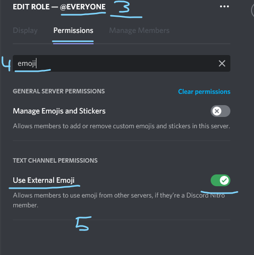
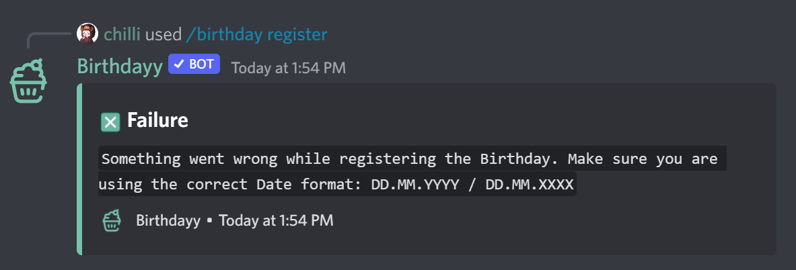

# Errors

## My Emojis are showing up as :emoji-name:

This is a common Error, that emojis are not showing up as emojis in Discord. There are some steps you can do to fix this issue.

Possible causes:

* Everyone Role missing “Use External Emoji” Permissions
* Bot Role disabled “Use External Emoji” Permissions
* Channel disabled "Use External Emoji" Permissions
* The highest Role of the Bot has disabled “Use External Emoji” Permissions

The most often Cause of this issue is Discord related.\
Go to the Server Settings 🠮 Roles 🠮 Default Permissions and check that the “Use External Emoji” permission is activated.

.png>)

.png>)

## Something went wrong while registering the Birthday.

<figure><figcaption></figcaption></figure>

**Get this Error while registering?** As the Error suggests, you might have used a wrong date.

The correct format is: _**DD.MM.YYYY**_ so for example _29.01.2003_ for the _29._ January _2003._


Still not working? Visit the Birthdayy HQ to get additional Support!



