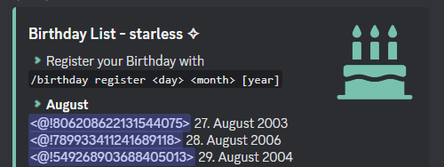

# General

## There are numbers instead of the User when doing /birthday list?

Does your Birthday list look like this?

<figure><figcaption>
There are numbers instead of the User
</figcaption></figure>

This Issue is related to how Discord Caches Data to ensure a smooth user experience and not much loadingtime. When the UserID instead of the UserTag is displayed it usualy means that the specific user is not yet loaded into yur cache.

Unfortunately there is nothing much I can do to solve this, since it is an Issue/Feature on Discords site. I am working on having a option to use nicknames instead of mentions, but this will take some time to get implemented.

#### What can I do to solve it?

You can force the cache to update with the data of the User. To do this write the following in the chat: \`<@THE\_NUMBER\_HERE>\` and send it.&#x20;

Note, that this is just a temporary solution and will only work until the discord app or your device restarts.

The Issue is way more common on Mobile Phones, espeacially Android. PC users should have a better experience, but it can still come to this issue on big server.

## The Announcement Message Embed is not displayed on someone's birthday?

<figure><figcaption>
Birthdayy only sends out a PingRole Mention
</figcaption></figure>

If you are facing this issue, check in the Role Settings, if the PingRole has enabled the "Allow anyone to @mention this role" Permission.&#x20;

<figure><figcaption></figcaption></figure>

This is a workaround currently and will be fixed in upcoming versions.
