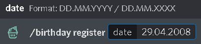
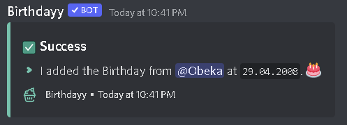

# Register your Birthday

Adding your birthday is one of the simplest tasks that can be done with the bot. Using the command _**/birthday register**_ and then adding the date of your birthday using the _**dd.mm.yyyy**_ format, birthday will automatically add your birthday to the server's birthday list!

For example, if your birthday is on April 29th 2008, your command should look like _**/birthday register 29.04.2008**_

Once you enter the command, your birthday will be announced in the specific server on the day of your birthday for all the members to see and wish you a happy birthday!


The Birthdayy bot is a _**per-server**_ bot. This means that if a few of the servers you're in include BIrthdayy, your birthday date will appear on only the ones you register on, _**NOT**_ the other ones.


### Hiding your Age

If you wish to keep your age a secret, Birthdayy has your back! Taking the same date as in the previous example, by typing _**/birthday register 29.04.XXXX**_ Birthdayy will accept the date and your age will be safe and sound!

<figure><figcaption></figcaption></figure>

<figure><figcaption></figcaption></figure>


Enjoy what Birthdayy offers you? Make sure to support us by clicking on [https://docs.birthdayy.xyz/extras/links/vote](https://docs.birthdayy.xyz/extras/links/vote) and voting with just a simple click!

