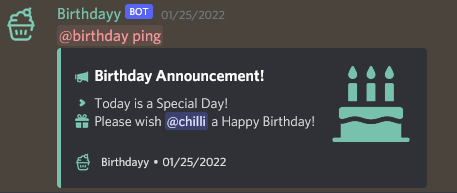

# Set up Announcement Channel

Announcing someone's birthday is going to be hard to do if the Birthdayy bot doesn't have an assigned Announcement channel to use. To successfully add a designated location for the celebration message to show, the owner of the server can use the _**/config announcement**_ command and then choose the channel they wish to use.

Once the command is used, on the day of someone's birthday, a reminder/celebration message should appear on the specific channel.

<figure><figcaption>
Birthday Announcement
</figcaption></figure>
