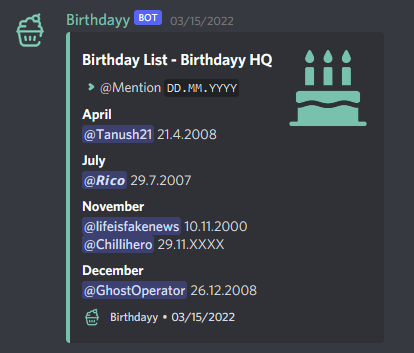

# Set up an Overview Channel

Just like the name gives it away, the Overview channel shows you a general review of all the birthdays registered in the server. By typing _**/config overview**_ and then clicking on the channel you wish the following list to show, every time a birthday is registered or updated, the list will automatically refresh it. This way, every member has the ability to pay attention to upcoming birthdays!

